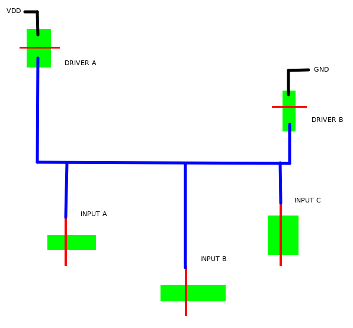

DMG-CPU B Game Boy Simulation
=============================

SystemVerilog code for simulating a Game Boy system with Icarus Verilog.
Most of the code is generated from the netlist files in
[msinger/dmg-schematics](https://github.com/msinger/dmg-schematics).


Files in this repo
------------------

| File(s)                              | Description                                                                                                                     |
| ------------------------------------ | ------------------------------------------------------------------------------------------------------------------------------- |
| ./dmg\_cpu\_b/cells/\*.sv            | Modules implementing all standard cells of the DMG-CPU B chip, including the RAM and ROM blocks.                                |
| ./dmg\_cpu\_b/dmg\_cpu\_b.sv         | The DMG-CPU B chip.                                                                                                             |
| ./sm83/cells/\*.sv                   | Modules implementing all cells in the SM83 CPU core, including the huge decoders.                                               |
| ./sm83/sm83.sv                       | The SM83 CPU core.                                                                                                              |
| ./dmg\_cpu\_b\_gameboy.sv            | Top level module that simulates a complete Game Boy system with DMG-CPU B chip, WRAM, VRAM, LCD, audio and cartridge.           |
| ./snd\_dump.sv                       | Code for dumping the APU's sound output to a file.                                                                              |
| ./vid\_dump.sv                       | Code for dumping the PPU's video signals to a file.                                                                             |
| ./mkvid/mkimgs.c                     | C code for extracting raw RGB frames from video signal dumps.                                                                   |
| ./mkvid/mkvid.sh                     | Bash script for combining dumped sound output and extracted RGB frames to a video.                                              |
| ./boot/quickboot.s                   | Assembly code for a boot ROM that boots in less than 0.2 seconds. Leaves the system in the same state as the original boot ROM. |


Requirements
------------

Of course, you need Icarus Verilog and GNU Make.

If you want to generate video files, you also need GCC, ImageMagick and FFmpeg.

The original boot ROM is not part of this repository. If you want to simulate the original boot ROM, you need to copy
a boot ROM image into the root of this repository with the name `DMG_ROM.bin`. Or you can place it anywhere else and
overwrite the make variable `BOOTROM` like `BOOTROM=/path/to/bootrom`.


Usage
-----

The default make target (sim-gameboy) simulates a complete Game Boy system (dmg\_cpu\_b\_gameboy.sv).
Run
```
make sim-gameboy
```
or just
```
make
```
to start the simulation. This simulates a Game Boy without cartridge, executing the boot ROM in `./DMG_ROM.bin`.

The simulation can produce any of the following files:

| File(s)                             | Description                                                                                             |
| ----------------------------------- | ------------------------------------------------------------------------------------------------------- |
| ./dmg\_cpu\_b\_gameboy.snd          | The APU's sound output. All four channels mixed into one 16 bit PCM file with 65536 Hz stereo.          |
| ./dmg\_cpu\_b\_gameboy\_ch[1-4].snd | One 8 bit PCM file with 65536 Hz mono for each channel. Only if CH\_DUMP=y is set on make command line. |
| ./dmg\_cpu\_b\_gameboy.vid          | The PPU's video signal dump. Can be used to extract images for a video.                                 |
| ./dmg\_cpu\_b\_gameboy.fst          | Dump of all signals in the system. Can be opened with GTKWave or any other wave viewer.                 |
| ./dmg\_cpu\_b\_gameboy.sav          | Cartridge SRAM gets dumped every 0.1 seconds.                                                           |

To produce a playable video file from those dumps, run
```
make dmg_cpu_b_gameboy.mkv
```


Make variables for configuration
--------------------------------

`BOOTROM=<path-to-binary>`:  
Specifies the boot ROM binary that is loaded into the boot ROM memory on startup. The path defaults to `DMG_ROM.bin`.
The file needs to have a size of 256 bytes. If it is shorter, the memory will have unknown (`'x`) values in simulation.

`ROM=<path-to-binary>`:  
Specifies a Game Boy ROM file that will be used as a cartridge. By default, the system will be simulated without any
cartridge inserted. As of now, the simulation supports no-MBC, MBC1 and MBC5 cartridges.

`SECS=<number-of-seconds>`:  
Specifies how many seconds will be simulated until the simulation terminates. The default is 6.0 seconds.
The simulation takes about 150 minutes of real time per simulated second on a Ryzen 5 3600 (with `TIMING=default`
and `SIMPLIFIED_OAM=y`).

`DUMP=fst` *(default)*, `DUMP=vcd`, `DUMP=`:  
By default, all internal signals are dumped in FST format. To dump in VCD, add `DUMP=vcd` to the make command line. `DUMP=`
disables dumping of internal signals. When signal dumps are disabled, the simulation runs faster. So when you want to
generate a video, then this may be useful.

`TIMING=default` *(default)*, `TIMING=nodelay`:  
Selects which timing model to use. `TIMING=default` simulates the system with (hopefully) realistic signal propagation
delays. Delays are calculated based on individual transistor sizes and wire lengths. `TIMING=nodelay` simulates the system
with 0 delays instead. Without delays, the simulation may run faster, but the exact behavior of the real device depends
on glitches that emerge from "bad timing". You need to run `make clean` when changing this variable, because delays in
Verilog are compile time constants, meaning the code needs to be recompiled.

`SIMPLIFIED_OAM=y` *(default)*, `SIMPLIFIED_OAM=`:  
The default (`SIMPLIFIED_OAM=y`) greatly increases simulation speed. It simulates the SRAM blocks of the OAM with reduced
complexity. With this simplification, the infamous OAM bug is not present though. With `SIMPLIFIED_OAM=`, the simplification
is disabled and the simulation can predict which RAM rows will be corrupted by the OAM bug. You need to run `make clean`
when changing this variable, because the code needs to be recompiled.

`SIMPLIFIED_WAVERAM=y` *(default)*, `SIMPLIFIED_WAVERAM=`:  
The default (`SIMPLIFIED_WAVERAM=y`) greatly increases simulation speed. It simulates the SRAM block of the Wave RAM with
reduced complexity. With this simplification, Blargg's dmg\_sound test No. 10 won't pass. With `SIMPLIFIED_WAVERAM=`,
the simplification is disabled and the simulation can predict which RAM rows or bytes will be corrupted by the wave restart
bug. You need to run `make clean` when changing this variable, because the code needs to be recompiled.

`MBC_TYPE=<hex>`:  
By default, the MBC/cartridge type gets read from ROM address 0x147. This variable overrides that value.

`RAM_SIZE=<hex>`:  
By default, the cartridge SRAM size gets read from ROM address 0x149. This variable overrides that value.


"Quickboot" boot ROM
--------------------

It takes a lot of time to simulate the Game Boy, so if you want to minimize the time that the simulation spends with
running the boot ROM, you can use `quickboot.bin` in the `boot` folder. This ROM takes less than 200 milliseconds of
simulation time before it enters cartridge code. It recreates the same system state that the original DMG-CPU A/B/C
boot ROM creates, but with one exception: The VRAM gets zeroed, it does not fill it with the Nintendo logo. The DIV
register and the PPU get precisely synchronized with the boot ROM exit so that test ROMs that test for this will pass
just fine. You can rebuild the binary from source using the [SM83 Binutils](https://github.com/msinger/binutils-sm83).

To use this boot ROM, you can either make it the default by moving it to the root of the repository and rename it
to `DMG_ROM.bin`, or by adding the variable `BOOTROM=boot/quickboot.bin` to the `make` command line.


Example usage
-------------

Simulate 120 seconds of Zelda with quickboot ROM:
```
make sim-gameboy BOOTROM=boot/quickboot.bin \
                 ROM=~/GB\ roms/Legend\ of\ Zelda\,\ The\ -\ Link\'s\ Awakening\ DX.gbc \
                 SECS=120.0 \
                 DUMP=
```

Wait a few days (seriously!), and the run
```
make dmg_cpu_b_gameboy.mkv
```
to generate a video file of the Zelda intro.


Tests
-----

Results of Blargg's tests:

| Test                                | Result (no delay) | Result (with delay) |
| ----------------------------------- | :---------------: | :-----------------: |
| cgb\_sound                          |         n/a       |          n/a        |
| cpu\_instrs                         |         ✅        |          ✅         |
| dmg\_sound/01-registers             |         ✅        |          ✅         |
| dmg\_sound/02-len ctr               |         ✅        |          ✅         |
| dmg\_sound/03-trigger               |         ✅        |          ✅         |
| dmg\_sound/04-sweep                 |         ✅        |          ✅         |
| dmg\_sound/05-sweep details         |         ✅        |          ✅         |
| dmg\_sound/06-overflow on trigger   |         ✅        |          ✅         |
| dmg\_sound/07-len sweep period sync |         ✅        |          ✅         |
| dmg\_sound/08-len ctr during power  |         ✅        |          ✅         |
| dmg\_sound/09-wave read while on    |         ✅        |          ✅         |
| dmg\_sound/10-wave trigger while on |         🚫\*\*    |          🚫\*\*     |
| dmg\_sound/11-regs after power      |         ✅        |          ✅         |
| dmg\_sound/12-wave write while on   |         ✅        |          ✅         |
| halt\_bug                           |         ✅        |          ✅         |
| instr\_timing                       |         ✅        |          ✅         |
| interrupt\_time                     |         n/a       |          n/a        |
| mem\_timing                         |         ✅        |          ✅         |
| oam\_bug                            |         🚫\*      |          🚫\*       |

*\* oam\_bug tests depend on small differences in signal delays which could change with temperature. According to
    [SameBoy](https://github.com/LIJI32/SameBoy/blob/master/Core/memory.c) some edge cases indeed behave
    nondeterministic on real hardware, so this will most likely never behave "correctly" in a purely digital
    simulation.*

*\*\* Re-triggering the wave channel produces a corruption inside the wave RAM that is very similar to the OAM bug.
      The simulation can't always predict how exactly the bits in the RAM change.*

Note: The Blargg tests suffixed with `-2` are not listed here, because they run exactly the same test code as the versions
without the suffix, but with much slower boilerplate code stitched around them, so they just waste a lot of CPU time.
(Running all the test ROMs through the simulation already takes over ten days! 🐌🐌🐌)

Results of Mooneye GB tests:

| Test                                           | Result (no delay) | Result (with delay) |
| ---------------------------------------------- | :---------------: | :-----------------: |
| acceptance/add\_sp\_e\_timing                  |         ✅        |          ✅         |
| acceptance/bits/mem\_oam                       |         ✅        |          ✅         |
| acceptance/bits/reg\_f                         |         ✅        |          ✅         |
| acceptance/bits/unused\_hwio-GS                |         ✅        |          ✅         |
| acceptance/boot\_div-dmg0                      |         n/a       |          n/a        |
| acceptance/boot\_div-dmgABCmgb                 |         ✅        |          ✅         |
| acceptance/boot\_div-S                         |         n/a       |          n/a        |
| acceptance/boot\_div2-S                        |         n/a       |          n/a        |
| acceptance/boot\_hwio-dmg0                     |         n/a       |          n/a        |
| acceptance/boot\_hwio-dmgABCmgb                |         ✅        |          ✅         |
| acceptance/boot\_hwio-S                        |         n/a       |          n/a        |
| acceptance/boot\_regs-dmg0                     |         n/a       |          n/a        |
| acceptance/boot\_regs-dmgABC                   |         ✅        |          ✅         |
| acceptance/boot\_regs-mgb                      |         n/a       |          n/a        |
| acceptance/boot\_regs-sgb                      |         n/a       |          n/a        |
| acceptance/boot\_regs-sgb2                     |         n/a       |          n/a        |
| acceptance/call\_cc\_timing                    |         ✅        |          ✅         |
| acceptance/call\_cc\_timing2                   |         ✅        |          ✅         |
| acceptance/call\_timing                        |         ✅        |          ✅         |
| acceptance/call\_timing2                       |         ✅        |          ✅         |
| acceptance/di\_timing-GS                       |         ✅        |          ✅         |
| acceptance/div\_timing                         |         ✅        |          ✅         |
| acceptance/ei\_sequence                        |         ✅        |          ✅         |
| acceptance/ei\_timing                          |         ✅        |          ✅         |
| acceptance/halt\_ime0\_ei                      |         ✅        |          ✅         |
| acceptance/halt\_ime0\_nointr\_timing          |         ✅        |          ✅         |
| acceptance/halt\_ime1\_timing                  |         ✅        |          ✅         |
| acceptance/halt\_ime1\_timing2-GS              |         ✅        |          ✅         |
| acceptance/if\_ie\_registers                   |         ✅        |          ✅         |
| acceptance/instr/daa                           |         ✅        |          ✅         |
| acceptance/interrupts/ie\_push                 |         ✅        |          ✅         |
| acceptance/intr\_timing                        |         ✅        |          ✅         |
| acceptance/jp\_cc\_timing                      |         ✅        |          ✅         |
| acceptance/jp\_timing                          |         ✅        |          ✅         |
| acceptance/ld\_hl\_sp\_e\_timing               |         ✅        |          ✅         |
| acceptance/oam\_dma/basic                      |         ✅        |          ✅         |
| acceptance/oam\_dma/reg\_read                  |         ✅        |          ✅         |
| acceptance/oam\_dma/sources-dmgABCmgbS         |         ✅        |          ✅         |
| acceptance/oam\_dma\_restart                   |         ✅        |          ✅         |
| acceptance/oam\_dma\_start                     |         ✅        |          ✅         |
| acceptance/oam\_dma\_timing                    |         ✅        |          ✅         |
| acceptance/pop\_timing                         |         ✅        |          ✅         |
| acceptance/ppu/hblank\_ly\_scx\_timing-GS      |         ✅        |          ✅         |
| acceptance/ppu/intr\_1\_2\_timing-GS           |         ✅        |          ✅         |
| acceptance/ppu/intr\_2\_0\_timing              |         ✅        |          ✅         |
| acceptance/ppu/intr\_2\_mode0\_timing          |         ✅        |          ✅         |
| acceptance/ppu/intr\_2\_mode0\_timing\_sprites |         ✅        |          ✅         |
| acceptance/ppu/intr\_2\_mode3\_timing          |         ✅        |          ✅         |
| acceptance/ppu/intr\_2\_oam\_ok\_timing        |         ✅        |          ✅         |
| acceptance/ppu/lcdon\_timing-dmgABCmgbS        |         ✅        |          ✅         |
| acceptance/ppu/lcdon\_write\_timing-GS         |         ❌        |          ✅         |
| acceptance/ppu/stat\_irq\_blocking             |         ✅        |          ✅         |
| acceptance/ppu/stat\_lyc\_onoff                |         ✅        |          ✅         |
| acceptance/ppu/vblank\_stat\_intr-GS           |         ✅        |          ✅         |
| acceptance/push\_timing                        |         ✅        |          ✅         |
| acceptance/rapid\_di\_ei                       |         ✅        |          ✅         |
| acceptance/ret\_cc\_timing                     |         ✅        |          ✅         |
| acceptance/ret\_timing                         |         ✅        |          ✅         |
| acceptance/reti\_intr\_timing                  |         ✅        |          ✅         |
| acceptance/reti\_timing                        |         ✅        |          ✅         |
| acceptance/rst\_timing                         |         ✅        |          ✅         |
| acceptance/serial/boot\_sclk\_align-dmgABCmgb  |         ✅        |          ✅         |
| acceptance/timer/div\_write                    |         ✅        |          ✅         |
| acceptance/timer/rapid\_toggle                 |         ✅        |          ✅         |
| acceptance/timer/tim00                         |         ✅        |          ✅         |
| acceptance/timer/tim00\_div\_trigger           |         ✅        |          ✅         |
| acceptance/timer/tim01                         |         ✅        |          ✅         |
| acceptance/timer/tim01\_div\_trigger           |         ✅        |          ✅         |
| acceptance/timer/tim10                         |         ✅        |          ✅         |
| acceptance/timer/tim10\_div\_trigger           |         ✅        |          ✅         |
| acceptance/timer/tim11                         |         ✅        |          ✅         |
| acceptance/timer/tim11\_div\_trigger           |         ✅        |          ✅         |
| acceptance/timer/tima\_reload                  |         ✅        |          ✅         |
| acceptance/timer/tima\_write\_reloading        |         ✅        |          ✅         |
| acceptance/timer/tma\_write\_reloading         |         ✅        |          ✅         |
| madness/mgb\_oam\_dma\_halt\_sprites           |         ✅        |          ✅         |
| manual-only/sprite\_priority                   |         ✅        |          ✅         |


Timing Model
------------

The simulation itself is running on gate/cell level. The signal delays however are calculated on transistor level,
taking into account every transistor within each cell to calculate total delays through cells.

The signal delays are calculated based on the following properties:

- Total resistance and capacity of the net. The resistance and capacity are calculated from the net's length.
- Resistance (driving strength) and type (NMOS/PMOS) of the transistor that drives the net. The resistance is
  calculated from the transistor width.
- Total capacity of all transistor gates driven by the net. The capacity is calculated from the widths of the
  transistors.

Very simplified example of a net:  
  
In this example, the inputs A, B and C can be driven by drivers A or B through the blue net. For each of the two
drivers of the net the signal delay is calculated separately. Driver A calculates the delay based on driver A's width,
the net's total length, and the total width of the three gate inputs A, B and C. Driver B calculates the delay mostly
the same, but instead of driver A's width, it uses driver B's width of course.

One would think that driver A has less resistance than driver B, since driver A is twice as wide, but this would only be
the case when comparing transistors of the same type. Driver A in this example is a PMOS transistor. PMOS transistors
are only half as efficient as NMOS transistors. Therefore, a PMOS with twice the width of an NMOS has roughly the same
resistance as the NMOS, due to its halved efficiency.

The model does ***not*** account for the fact that the signal delay should be shorter for the path from driver B to
input C. It always uses the total length of the net for the calculation. This model has more limitations: It does not
discriminate between materials (metal, poly, active), and it always assumes driving transistors or chains of driving
transistors are sourced by VDD or GND directly. This leads to way too short delays when modelling transmission gates.
I had to manually adjust this in some flip-flop cells that contain muxers implemented with transmission gates.

I tuned the constants in `dmg_cpu_b/timing-default.sv` and `sm83/timing-default.sv` to make the simulation fit as best
as I could with reality. I made the following measurements on the cartridge port of a real Game Boy DMG-CPU B:

| Name                                              | Description                                                                                                                           |
| ------------------------------------------------- | ------------------------------------------------------------------------------------------------------------------------------------- |
| rd&#x2011;glitch                                  | The width of the 0-hazard glitches that happen on the `/RD` line when the CPU writes to the internal HRAM or memory mapped registers. |
| phi&#x2011;rise&#x2011;rd&#x2011;rise             | Delay between rising `PHI` and rising `/RD` at the beginning of a cartridge write access.                                             |
| phi&#x2011;rise&#x2011;rd&#x2011;fall             | Delay between rising `PHI` and falling `/RD` at the end of a cartridge write access.                                                  |
| phi&#x2011;rise&#x2011;a15&#x2011;rise            | Delay between rising `PHI` and rising `A15` at the end of each ROM access.                                                            |
| phi&#x2011;rise&#x2011;a15&#x2011;fall            | Delay between rising `PHI` and falling `A15` at the beginning of each ROM access.                                                     |
| phi&#x2011;rise&#x2011;cs&#x2011;rise             | Delay between rising `PHI` and rising `/CS` at the end of RAM access.                                                                 |
| wr&#x2011;rise&#x2011;phi&#x2011;rise             | Delay between rising `/WR` and rising `PHI` at the end of a cartridge write access.                                                   |
| phi&#x2011;fall&#x2011;wr&#x2011;fall             | Delay between falling `PHI` and falling `/WR` at the beginning (or rather in the very middle) of a cartridge write access.            |
| phi&#x2011;rise&#x2011;a14&#x2011;fall&#x2011;ext | Delay between rising `PHI` and falling `A14` at the end of a cartridge access.                                                        |
| phi&#x2011;rise&#x2011;a14&#x2011;fall&#x2011;int | Delay between rising `PHI` and falling `A14` at the end of internal HRAM access.                                                      |
| a8&#x2011;rise&#x2011;a7&#x2011;rise              | Delay between rising `A8` and rising `A7` at the beginning of internal HRAM access.                                                   |

Here is the comparison of the measured delays vs. the delays in simulation:

| Name                                              | Measured      | Simulation Result | Deviation |
| ------------------------------------------------- | ------------: | ----------------: | --------: |
| rd&#x2011;glitch                                  |  18.6&nbsp;ns |    19.230&nbsp;ns |     +3.3% |
| phi&#x2011;rise&#x2011;rd&#x2011;rise             | 148.4&nbsp;ns |   142.042&nbsp;ns |     -4.3% |
| phi&#x2011;rise&#x2011;rd&#x2011;fall             |  23.0&nbsp;ns |    24.296&nbsp;ns |     +5.6% |
| phi&#x2011;rise&#x2011;a15&#x2011;rise            |   3.6&nbsp;ns |     2.385&nbsp;ns |    -33.8% |
| phi&#x2011;rise&#x2011;a15&#x2011;fall            | 241.0&nbsp;ns |   241.076&nbsp;ns |     ~0.0% |
| phi&#x2011;rise&#x2011;cs&#x2011;rise             |   4.4&nbsp;ns |     2.354&nbsp;ns |    -46.5% |
| wr&#x2011;rise&#x2011;phi&#x2011;rise             | 115.6&nbsp;ns |   116.528&nbsp;ns |     +0.8% |
| phi&#x2011;fall&#x2011;wr&#x2011;fall             |   5.0&nbsp;ns |     5.006&nbsp;ns |     +0.1% |
| phi&#x2011;rise&#x2011;a14&#x2011;fall&#x2011;ext |  28.0&nbsp;ns |    19.246&nbsp;ns |    -31.3% |
| phi&#x2011;rise&#x2011;a14&#x2011;fall&#x2011;int | 150.0&nbsp;ns |   142.964&nbsp;ns |     -4.7% |
| a8&#x2011;rise&#x2011;a7&#x2011;rise              |   4.2&nbsp;ns |     4.204&nbsp;ns |     ~0.0% |
